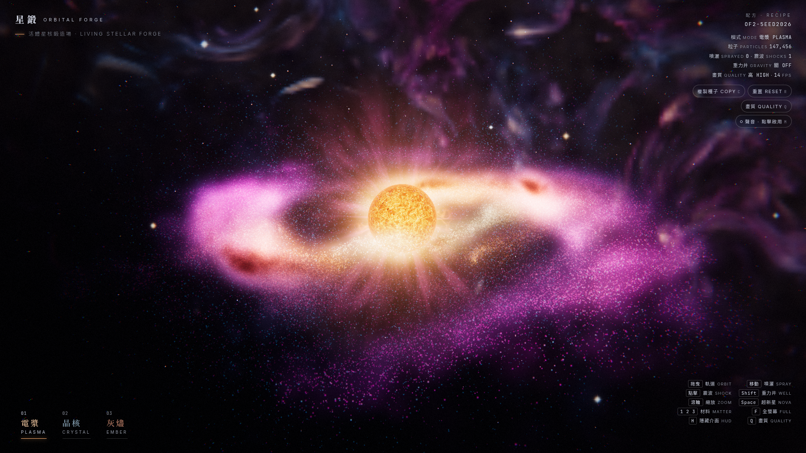
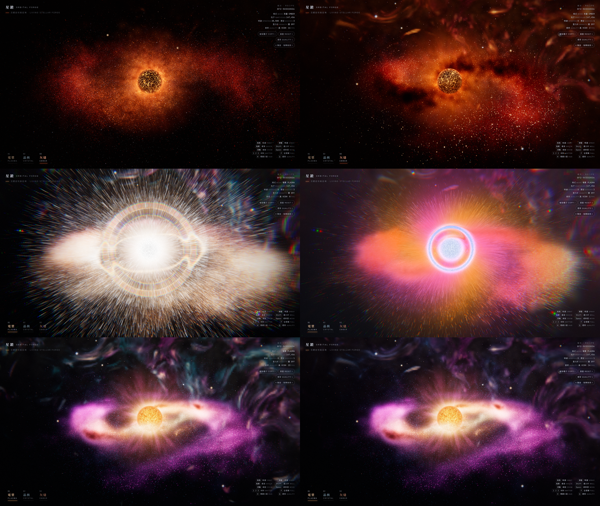

# 星鍛 Orbital Forge

> 以星為砧 · 以光為錘 — *The star is the anvil, light is the hammer.*

一個在瀏覽器裡即時運算的「星核鍛造場」：用滑鼠噴灑星塵、釋放震波、開重力井，按空白鍵引爆超新星，看吸積盤在約 10 秒內重新凝聚。純前端、無建置步驟，Three.js r160 + 自寫 GPGPU 與後製管線。
*A real-time WebGL2 stellar forge: spray stardust, fire shockwaves, open gravity wells and trigger a supernova.*

**開始日期 Started:** 2026-10-07

## 線上試玩 · Live demo

| 版本 | 網址 |
|---|---|
| **v2（目前版本）** | https://thedreamerstop.github.io/grok-bot-showroom/20261007-orbital-forge/ |
| v1（初版，對照用） | https://thedreamerstop.github.io/grok-bot-showroom/20261007-orbital-forge/v1/ |

請用**桌面版 Chrome**（需 WebGL2）。首次點擊／按鍵後才會啟用聲音。



### v1 → v2 對照 · Before / after



## 操作 · Controls

| 輸入 Input | 動作 Action |
|---|---|
| 拖曳 Drag | 軌道旋轉鏡頭 Orbit |
| 移動滑鼠 Move | 噴灑／雕塑星塵 Spray |
| 點擊 Click | 震波 Shockwave |
| 按住 Shift | 重力井 Gravity well |
| 滾輪 Wheel | 縮放 Zoom |
| `1` / `2` / `3` | 電漿 Plasma / 晶核 Crystal / 灰燼 Ember |
| `Space` | 超新星 Supernova |
| `F` | 全螢幕 Fullscreen |
| `H` | 隱藏介面 Hide HUD |
| `R` | 重置 Reset |
| `Q` | 畫質 LOW / MED / HIGH / ULTRA |
| `M` | 聲音開關 Sound |
| `C`／「複製種子」 | 複製種子 `OF2-XXXXXXXX` 與參數 |

URL 參數：`?seed=HEX`、`?mode=1..3`、`?q=0..3`（`?shot=1` 僅供截圖：固定時間步、較少粒子）。
例：<https://thedreamerstop.github.io/grok-bot-showroom/20261007-orbital-forge/?mode=3>

## 技術 · Techniques

- **Three.js r160**（本地 `vendor/`：`three.module.js` + `examples/jsm/misc/GPUComputationRenderer.js`），以 importmap 載入，無建置步驟。
- **GPGPU 粒子**：position／velocity 浮點紋理 ping-pong，HIGH 262,144 顆、ULTRA 589,824 顆；開普勒軌道 + bitangent curl noise（解析梯度 simplex）+ 對數螺旋密度波旋臂；溫度模型 → 調色盤。
- **粒子渲染**：instanced quad 依速度拉伸、次像素能量守恆、溫度 → 色彩。
- **HDR 後製**：HalfFloat + MSAA → 多層 mip bloom（13-tap 下採樣 + Karis 平均 + tent 上採樣）→ ACES 色調映射、色差、鏡頭髒污、暗角、底片顆粒；超新星期間改用保色相色調映射。
- **程序化星核**：電漿（沸騰 fbm、米粒組織、臨邊昏暗）、晶核（Voronoi 晶面）、灰燼（熔岩裂縫）＋ 日冕流光與日珥。
- **背景**：每模式烘焙的 raymarch 星雲 cubemap（domain-warped fbm + ridged 纖維 + 暗塵帶），切換模式時交叉淡入。
- **螢幕空間特效**：震波折射漣漪、重力井的重力透鏡／事件視界／光子環、開場景深。
- **WebAudio 合成音效**：低頻 drone、殘響、震波重擊、超新星上升音、噴灑嘶聲、重力嗡鳴。
- **自動降級**：平均 FPS < 42 時自動降畫質。

## 版本歷史 · Version history

| 版本 | 日期 | 內容 |
|---|---|---|
| v1 | 2026-10-07 | 單檔 HTML：6,000 顆 CPU 粒子 + additive sprite 假 bloom、三種材料、震波、重力井、核心爆發、開場鏡頭。→ [`v1/`](v1/)、[報告](docs/REPORT-v1.md) |
| v2 | 2026-10-08 | 全面重建：GPU 粒子、HDR bloom 管線、程序化星核、星雲 cubemap、超新星完整序列、重力透鏡、WebAudio、畫質切換；同日第 2 輪精修（灰燼模式層次、超新星有色閃光、星雲整理、HUD 對比、開場景深）。→ [報告](docs/REPORT-v2.md)、[工作筆記](docs/CHECKPOINT.md) |

## 已知限制 · Known limits

- **僅支援桌面 Chrome（WebGL2 + 浮點 render target）**；沒有行動版適配。
- **60 FPS 是設計目標，尚未在實體 GPU 上驗證**：開發與截圖都在軟體 GPU（SwiftShader）上完成。弱 GPU／內顯會自動降到 MED/LOW，也可以按 `Q` 手動切換。
- 字體從 Google Fonts 載入，離線或被擋時退回系統字體。
- 其他模式的星雲在開場後才於背景烘焙，太早切換模式可能短暫卡頓。
- 超新星峰值時星核表面在極亮處會有細顆粒；灰燼模式左下方畫面仍偏空。
- 開場景深是單次 16-tap 圓盤模糊，不是真正的散景。

## 資料夾內容 · Layout

```
20261007-orbital-forge/
├── index.html          v2 入口（Pages demo）
├── js/                 main.js · shaders.js · noise.js · audio.js
├── vendor/             three.module.js (r160) · examples/jsm/misc/GPUComputationRenderer.js
├── v1/                 v1 可試玩版本（index.html + vendor/three.module.js）
├── shots/              v2 截圖（*-v2a = 第 2 輪精修前）、shots/v1/ 為 v1 截圖
├── docs/               REPORT-v2.md · CHECKPOINT.md · REPORT-v1.md
└── tools/              headless Chrome 截圖／錯誤檢查工具（見 tools/README.md）
```

截圖說明：1920×1080，headless Chrome + SwiftShader 拍攝（`?shot=1`，147k 粒子）。`hero.png`、`before-after.png` 為原始 PNG，其餘轉存為 JPEG（q90）以縮小 repo。

## 本地執行 · Run locally

```bash
# 在 repo 根目錄
python3 -m http.server 8765
# 開啟 http://localhost:8765/20261007-orbital-forge/
```

> 開發期間曾以匿名 ship.place 網址部署（見 docs），那些網址約 2026-11-07 到期；以上方 GitHub Pages 網址為準。
