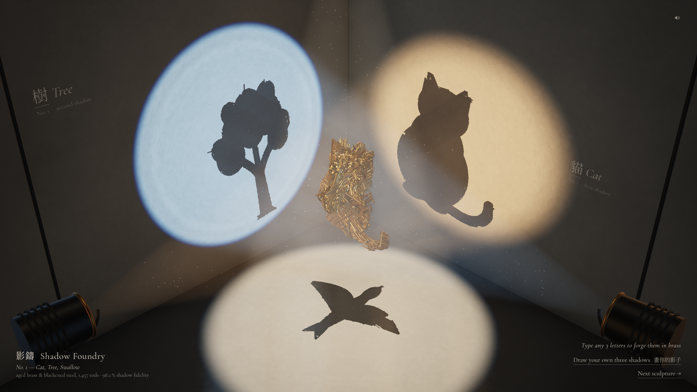

# 影鑄 Shadow Foundry

**▶ Live:** https://thedreamerstop.github.io/grok-bot-showroom/20261008-shadow-foundry/

---

## 中文

**一團黃銅桿，正面看什麼都不是；從側面看，是三幅畫。**

約 1,500 根做舊黃銅桿以一條細線懸在天花板下，三盞軌道燈各自把它的影子投在一面牆上：東牆、北牆與拋光地板。多數角度下，影子只是一團亂線。把雕塑轉到唯一正確的角度，三個影子會同時鎖定成畫面：一隻貓、一棵樹、一隻燕子。

### 怎麼玩
- **觀看開場**《鍛造》（約 5 秒；點擊或按 Esc 跳過）：三盞燈喀一聲亮起，上千根黃銅桿從黑暗中飛入、在空中翻騰成一團風暴，約 4.2 秒起一起內爆，約第 5 秒三個影子同時鎖定成形。
- **拖曳** 轉動雕塑：左右拖轉向、上下拖傾斜。接近正解時，影子邊緣會變銳利、聲音會調準，並有輕微的磁吸。約 20 秒沒有任何操作時，雕塑會慢慢轉回正解，三幅畫重新出現；一動滑鼠或按鍵就會停止。
- **輸入三個字母**（A–Z）：當場鑄造一座文字雕塑。會盡量依輸入順序，由左牆、右牆、地板各投出一個字母；若這樣投得較差，背景程式會調換牆面順序或把地板字母轉成 45°，展示牌會寫明實際投影順序，例如「CAT · cast as C·T·A」（22 個測試字中有 10 個被調換順序）。
- **成為那盞燈**：點右下的「Be the lamp · 1 2 3」、雙擊燈頭，或按 **1 / 2 / 3**（左燈／右燈／地板燈），鏡頭飛進燈裡、順著光束往下看。從燈的位置看，黃銅雕塑本身的輪廓就是那個圖形，你會在黃銅裡看見那隻貓。按 Esc 或點一下即可返回；碎裂或鑄造開始時也會自動返回。
- **畫出自己的三個影子**：每面亮牆畫一個輪廓（封閉線條會自動填滿），按「Forge」，背景 Web Worker 就會算出一座能投出這三個影子的新雕塑。
- **點擊雕塑** 或「Next sculpture」：雕塑碎成風暴，再內爆成下一件作品：No. 2（手・鑰匙・蝴蝶）、No. 3（G・E・B，向《哥德爾、艾舍爾、巴赫》封面致敬）。
- **拖曳燈具** 沿天花板軌道移動：光圈滑動，影子即時重新投影並拉伸變形；放手後燈會彈回原位，喀一聲。
- **分享**：「Copy share link」複製如 `…/20261008-shadow-foundry/#w=GEB` 的網址；打開即直接鑄造該字。若瀏覽器拒絕剪貼簿，網址會在小欄位中選取好，按 Ctrl+C 即可。
- 聲音全為程式合成，第一次點擊後才啟動（在那之前，右上角喇叭會微微閃動並提示「click anywhere for sound」）；喇叭可靜音，設定會被記住。

### 技術
影子藝術／視覺外殼（Mitra & Pauly, *Shadow Art*, 2009）、桿件沿遮罩距離場追蹤、實際桿件投影覆蓋率量測（內建作品 ≥ 98 %）；three.js r160 自訂石膏著色器（Poisson PCF 軟影、鏡頭光斑）、體積霧（由陰影貼圖切出光束）、HDR + ACES 合成；Web Worker 鑄造；WebAudio 程式音效與限幅器；依幀時間自動調整畫質（變慢時先降霧再降解析度，不動陰影貼圖；幀時間回到 18 ms 以下 5 秒後逐級恢復，60 Hz 螢幕也能恢復）。純靜態檔案，無建置步驟。

### 已知限制
只在軟體繪圖（SwiftShader）下測試過，尚未在真實 GPU 上量測幀率；從主鏡頭看，雕塑本身也隱約看得出圖形；部分字母組合（如 LOV）較難投得乾淨，也可能被調換牆面順序。僅支援桌面（1280×800–1920×1080，WebGL2）。

---

## English

*A brass sculpture that is nothing from the front, and three different pictures from the side.*

About 1,500 aged-brass rods hang from the ceiling on a single wire. Three track lamps each cast its shadow on a different surface: the east wall, the north wall and the dark polished floor. From most angles the shadows are formless tangles. Turn the sculpture to its one true angle and all three lock into pictures at once: a cat, a tree and a swallow.

### How to interact
- **Watch** the opening, *The Forge* (~5 s; click or Esc to skip). Three lamps clunk on; rods fly in out of the dark, swirl as a storm, and implode from about 4.2 s. At about 5 s all three shadows lock into pictures at once.
- **Drag** to turn the sculpture (horizontal = turn, vertical = tilt). Near the solution the shadows sharpen, the sound tunes in, and a soft magnetic detent catches you. After about 20 s with no input, the sculpture eases itself back to the solved pose so the pictures return; any input cancels it.
- **Type three letters** (A–Z) to forge a word sculpture. It aims to read in typed order (left wall, right wall, then the floor letter, upright from the camera). When that casts worse, the worker reorders the walls or tilts the floor letter to 45° (only for a worst-wall gain of > 6 / > 3 points), and the placard says so (e.g. *CAT · cast as C·T·A*; 10 of 22 test words were reordered). The placard also prints the measured coverage.
- **Be the lamp:** click *Be the lamp · 1 2 3*, double-click a lamp head, or press **1 / 2 / 3** (left / right / floor lamp). The camera flies into the lamp and looks down its beam. From there the brass sculpture's own silhouette *is* the figure: you see the cat in the brass itself. Esc or a click flies back, and a shatter or forge flies back on its own. Typing still works in lamp view; dragging is off.
- **Draw your own three shadows:** one silhouette per lit surface (closed outlines fill in), then *Forge*. A Web Worker computes a new rod sculpture that casts them.
- **Click the sculpture** (or *Next sculpture*) to shatter it into a storm that implodes into the next work: No. 2 (hand · key · butterfly), No. 3 (G · E · B, after Hofstadter's *Gödel, Escher, Bach* cover).
- **Drag a lamp** along its ceiling track: its pool slides and the shadow reprojects live. Let go and it springs home with a clunk.
- Nothing is a dead end: *Next* or *Draw* pressed mid-forge waits its turn, letters typed during the opening or a shatter are kept, a pasted link waits until you leave drawing mode, and Esc during a shared word's forge skips as soon as it's ready.
- Sound is procedural WebAudio. It starts on your first click or key press (no autoplay warnings; until then the speaker glyph pulses with a quiet *click anywhere for sound*), runs through a master limiter, and pauses while the tab is hidden. The speaker glyph mutes, and the choice is remembered.

### Share links
`https://thedreamerstop.github.io/grok-bot-showroom/20261008-shadow-foundry/#w=ABC`, where `ABC` is any three letters A–Z. Opening it plays *The Forge* straight into that word; pasting a new `#w=` into an open tab forges it too. Built-in and drawn works clear the hash. *Copy share link* uses the clipboard only; if that's denied, the URL is shown selected for Ctrl+C (⌘C). `?debug=1` shows a frame-time overlay.

### How it works
- **Shadow art / visual hull** (after Mitra & Pauly, *Shadow Art*, SIGGRAPH Asia 2009). A point is inside the sculpture iff its perspective projection from every lamp lands inside that lamp's mask. Per-figure similarity transforms are hill-climbed for hull fidelity, then a per-pixel ray test repairs unreachable pixels with the cheapest small discs.
- **Forging.** Long rods are sphere-traced inside the hull against signed-distance fields of the masks, in three gauges. Interior-repair rods fill holes, edge rods trace each outline, and a spur trim clips rods whose shadows leave the targets. Coverage is measured by rasterising the real rod capsules from each lamp. Built-ins are ≥ 98 % (No. 1 cat/tree/swallow 98.7/99.7/98.2 %, No. 2 98.7/98.1/98.2 % as logged by the live console; the placard prints the worst wall, 98.2 % and 98.1 %; No. 3 GEB 95.6/95.8/96.6 % in reading order with an upright floor B). In a 22-word table, typed words reach ≥ 90 % on the worst wall for 19 words and ≥ 95 % for 7, with a median forge of ~4 s.
- **Rendering** (three.js r160):
  - **Lighting:** each surface is lit only by its own lamp. A custom plaster shader samples that lamp's shadow map with rotated Poisson PCF, and its penumbra carries the "getting closer" cue. Procedural lens cookies shape three deliberately different pools: a soft ellipse, a small hard circle and a large floor pool. A one-bounce fake fills the room, and the polished floor has a blurred planar reflection.
  - **Atmosphere:** volumetric haze is marched through the shadow maps, so the rods slice the beams, more visibly during the storm. Dust motes, an HDR composite with ACES and grain.
  - **Brass:** instanced rods with per-rod AO, a brass key light and a Fresnel rim.
  - **Quality governor:** above 28 ms per frame it lowers haze samples, then pixel ratio (floor at 0.8, shadow maps untouched), and steps back up one level after 5 s under 18 ms per frame, so a 60 Hz display recovers.
- Everything is static files; no build step, no server.

### Known limitations
- Tested only with software rendering (headless Chrome + SwiftShader, ~0.3–8 fps). Real-GPU frame rates haven't been measured; the governor is there for slow machines.
- From the main camera the sculpture itself faintly reads as the figure (the visual hull has the figure's outline). *Be the lamp* turns this into the point, but the "nothing from the front" claim is only half true.
- Some letter triples cast poorly: LOV's worst wall is 75.7 %. Some words are cast in a different wall order or with a 45° floor letter; the placard says so.
- Desktop only (1280×800–1920×1080, WebGL2). No mobile work.

## Folder
| Path | Contents |
|---|---|
| `index.html`, `js/`, `style.css`, `fonts/`, `data/`, `vendor/` | the experience |
| `prototypes/` | the three Phase-B prototypes (Shadow Foundry, Lumen Atelier, Chladni) |
| `shots/` | screenshots and before/after evidence |

## Versions
- **Pass 3 / polish** (2026-10-08): placard titles hidden until the lock; typed order with an upright floor letter; spur trim; brass key + rim light; three distinct pools; plaster lift; frame-time governor + `?debug=1`; gesture-only audio with a limiter and remembered mute; dead-end fixes; storm streaks; *Be the lamp*. Final fixes after review #6: a *Be the lamp · 1 2 3* link and idle hint, a caption pill, leaving lamp view on shatter/forge, a sound cue until the first gesture, governor recovery under 18 ms, idle re-lock after 20 s.
- **Pass 2 / experience** (2026-10-08): *The Forge* implosion opening; shatter → storm → re-forge; type-three-letters word sculptures with `#w=` links; No. 3 GEB; hero push-in; draggable lamps.
- **Pass 1 / visual escalation** (2026-10-08): ≥ 98 % rod coverage; precomputed sculptures; a real room (ceiling track, wire, polished floor, bounce-lit plaster); dust; forging in a Web Worker.
- **V1** (2026-10-08): the lock sequence, constrained turntable with sharpening cues, draw-your-own, procedural sound, museum labels.

Fonts: Cormorant Garamond (OFL), Noto Serif TC (OFL), self-hosted subsets. three.js (MIT), vendored. Built with Grok Bot.
